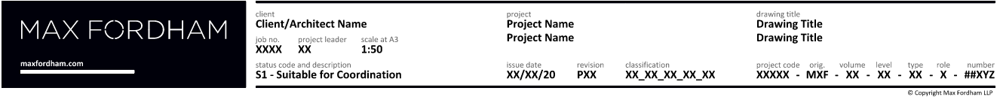
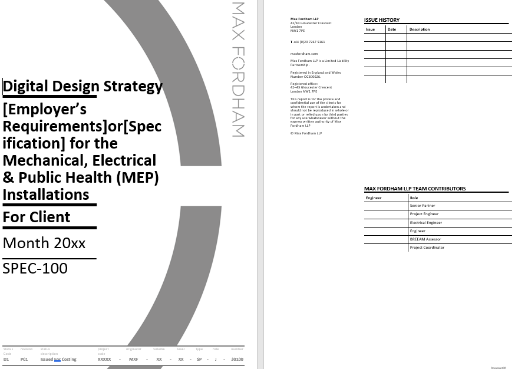
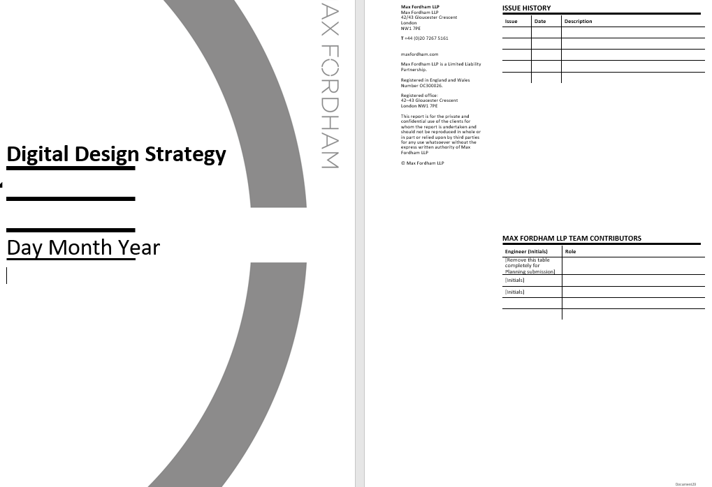
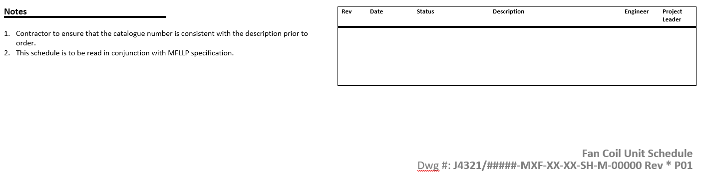
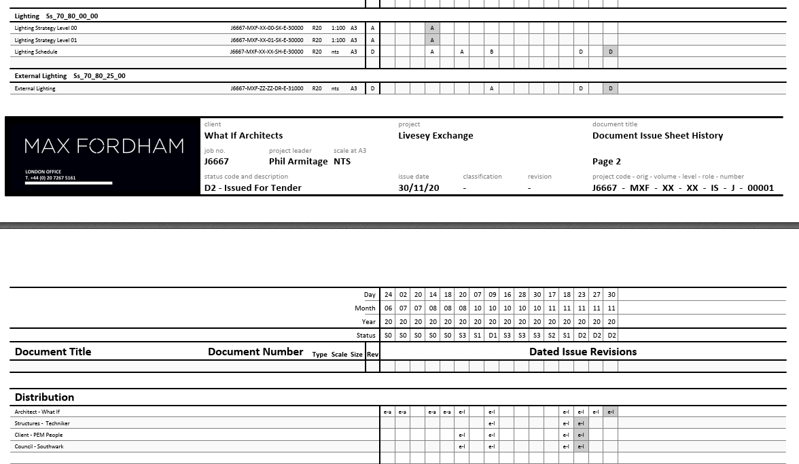

# Current Templates

```{figure} images/doc-issue-summary.png
---
name: doc-issue-summary
---
a summary of what document issue information is being shown on which
information type
```

## Drawings



- no "_authored by_" or "_checked by_" fields (or any authoring information)
- "_project leader_" only (same for all information)
- no issue history (this is in issue sheet)
- includes Uniclass classification field

## Specifications



- shows issue history
- no "_authored by_" or "_checked by_" fields
- roles on project indicated (not necessarily contributors to the specific document?)
- doesn't include Uniclass classification field
- status not shown in Issue History

## Reports



- no structured filename information
- doesn't include Uniclass classification field

## Schedules



- shows issue history
- includes "_engineer_" and "_project leader_" for every issue
- doesn't include Uniclass classification field

## Issue Sheets



- no authoring information
- doesn't include Uniclass classification field

## Notes from J6865

example: __6865 WOOD WHARF PHASE 3 J1-J3__ (but probably the same for all Canary Wharf Projects)

Canary Wharf QA process required: ___Authored By___ and ___Checked By___ fields

Discussion from Pete B (Project Engineer for Project)

> We have used the engineer and project leader fields elsewhere to cover author and checked_by. However the distinction may get lost in 
> translation. Plus our more obstinate clients are asking for author and checked_by unique not only to the current document (1) but also for the
> document's history (2). The project leader field I imagine is set more globally, if automated.
>
> (1) showing current author and checked_by are hard to object to. Whilst, as far as I can see, there's nothing explicit in ISO 19650, I think it
> probably is implicit in the fact that a document controller (who knows nothing about the technical content) can somehow independently accept  
> on behalf of the appointing party that the document is suitable to be shared. For a simple and commonly used indication that it has been
> checked by someone who didn't originally draft it. (two pairs of eyes have seen it) the initials of the people involved is a practical way of
> this. It does also avoid personal identifiable information entering public domain (even if unintentional) which I also agree is important.
>
> (2) We have had QA rejections unfortunately from clients wanting to see the initials appear in the revision history. I don't see why they need > this since the information about authoring and checking is out of date and we don't retain other out of date information in the document (it
> would become contradictory, nonsensical and unreadable). However it has been habit for a long time and other consultants readily do it.  In
> isolation it seems such a small request that I'm not prepared to waste time arguing against it. Unless perhaps at the draft BEP stage if we spot > it. I'm sure others will feel the same.
