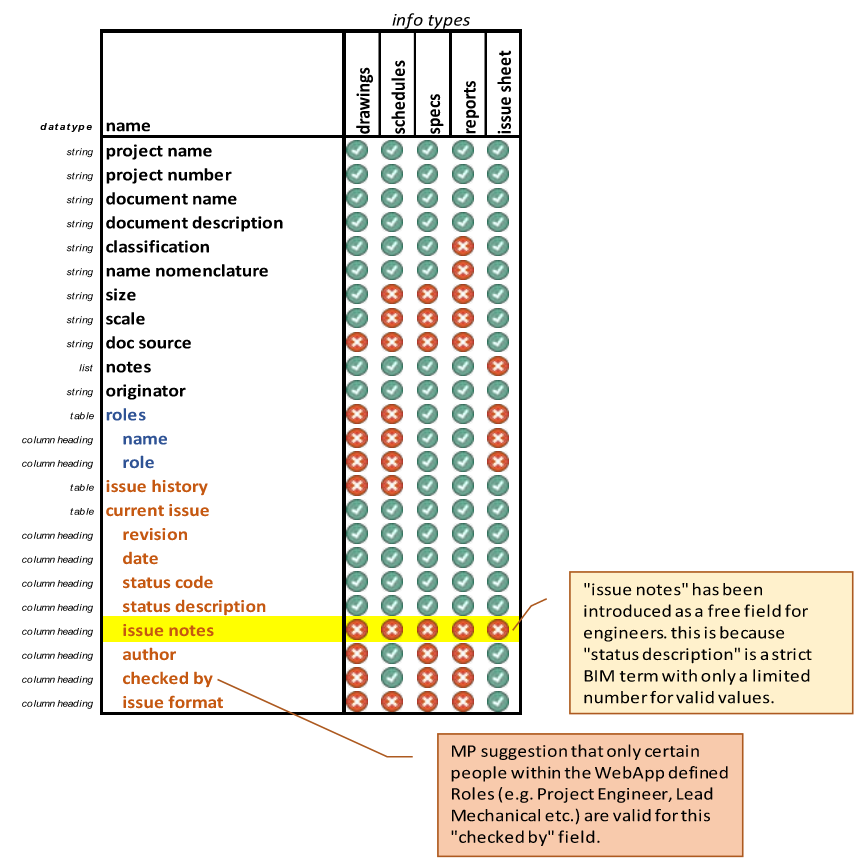

# Scope

The aim of this project and discussion is to clearly fix and define all metadata fields that are required to accompany
the structured documents that we issue on jobs. Currently our approach differs depending on information type, and for
some project (e.g. Canary Wharf) our current standard is missing information and we are forced to show more (see later).

In the [DocumentHeader](#DocumentHeader) section below a schema of the data fields that should be recorded for every documnent
is given, and in the [Example DocumentHeader datastructure](#Example-DocumentHeader-datastructure) the data object that was used
to create this file is given.

The intention is that the schema below defines all of the possible data fields that may be required for a given type of information.
Engineering Standards can still make the choice to not to show certain information on the output (e.g. not show author and checked_by on the Spec,
or the Drawings on typical jobs...), but the suggestion is that these fields are retained such that the general approach can support jobs (such as Canary Wharf), where these fields are explicitly required.

__Note__. that the schema below intentionally avoids considering the datafields that are used to create the Document Number.
For now this is still done in the DocumentNumberGenerator or in the Revit model.
In the future the suggestion would be that this Document Header logic and datastructure is extended to also include classification fields.

This document was reviewed at a ESOMG Core Group meeting and the following changes were incorporated:

- change name: checker --> checked_by
- added a issue_notes field to the issue history table as a free-field for engineers comments
- removed office specific location from the disclaimer (so it can be the same for all offices)
- lower case sentence case for table headings (matching the drawings). There was discussion about making this Title Case in the future.

## What information fields are we currently showing?

See appendix for more details. See [DocumentHeader](#DocumentHeader) for detailed definitions of terms.

## How does this link to WebApp Roles?

- The WebApp Roles would appear in the list of roles on the Spec (the user to filter out but not add new)
- Only "valid Roles" (i.e. Project Engineer, Lead Mechanical, Lead Electrical etc.) would be allowed to perform the Role of "checked_by" on information.
