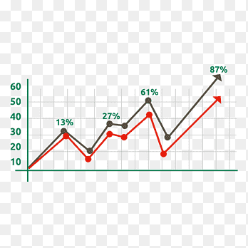

# Report

## Bar Chart

{}

## Table

+---+------------------------------------------------------------------------------------+
| 1 | This is a note                                                                     |
+---+------------------------------------------------------------------------------------+
| 2 | This is another note                                                               |
+---+------------------------------------------------------------------------------------+
| 3 | This is a very long note which states something important about the document issue |
+---+------------------------------------------------------------------------------------+

: {tbl-colwidths="[4,96]"}

## Table

+---+------------------------------------------------------------------------------------+
| 1 | This is a note                                                                     |
+---+------------------------------------------------------------------------------------+
| 2 | This is another note                                                               |
+---+------------------------------------------------------------------------------------+
| 3 | This is a very long note which states something important about the document issue |
+---+------------------------------------------------------------------------------------+

: {tbl-colwidths="[4,96]"}

## Line Graph

{}
