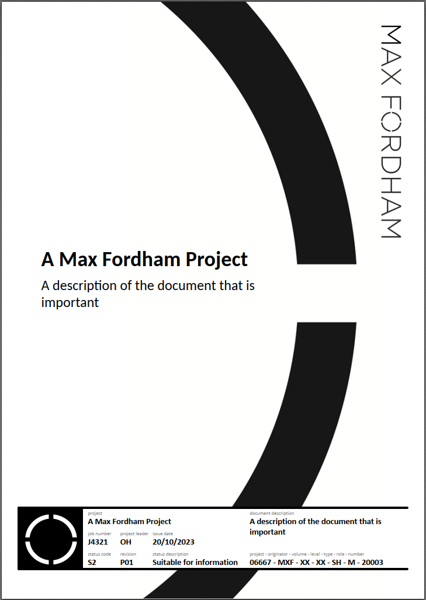

# Document Issue Quarto

This Quarto format is used to create Max Fordham PDF documents.



## Installation

Before following this, make sure you have Quarto installed in your environment. See [Installing Quarto](#installing-quarto) for instructions.

To use this format with an existing project or document, you can install it using the `quarto add` command.
Run the following command to install this format from the GitHub repository:

```quarto add maxfordham/document-issue/packages/document-issue-quarto```

Or to install with a local directory run:

```quarto add packages/document-issue-quarto```

Ensure you are in the root directory of this repository when running this command.

## Usage

Before running, feel free to check out the examples in (examples)[examples/].

To use the format, you can use the format names `document-issue-pdf` and `document-issue-latex`. For example:

```quarto render examples/product-output/document.md --to document-issue-pdf```

## Installing Quarto

As an aside, here is how to install Quarto using mamba (or conda):

Install Quarto
```bash
mamba install quarto
```

Install tinytex
```bash
quarto install tinytex
```

For more about Quarto and how to use format extensions, see <https://quarto.org/docs/journals/>.