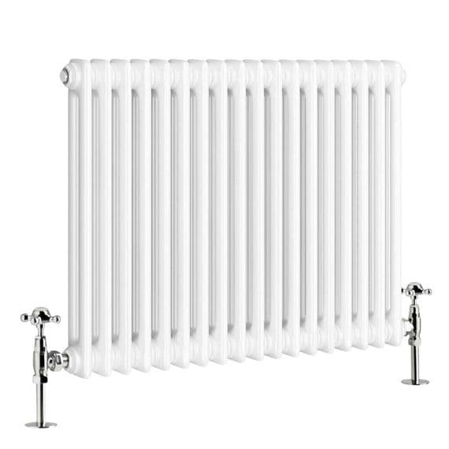
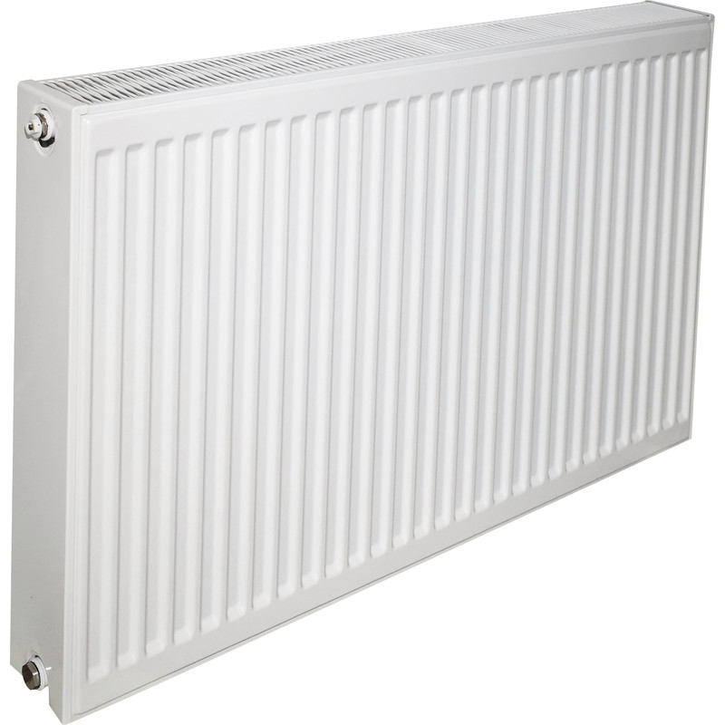

# Images

## A Red Circle

{width=30mm}

Above we can see an image of a red circle.



## Radiator Widths

::: {layout-ncol=3 layout-valign="bottom"}
{width=30mm}

{width=30mm}

{width=30mm}
:::

Above we can see many lovely looking radiators.

## Radiator Heights

::: {layout-ncol=3 layout-valign="bottom"}
{height=30mm}

:::
