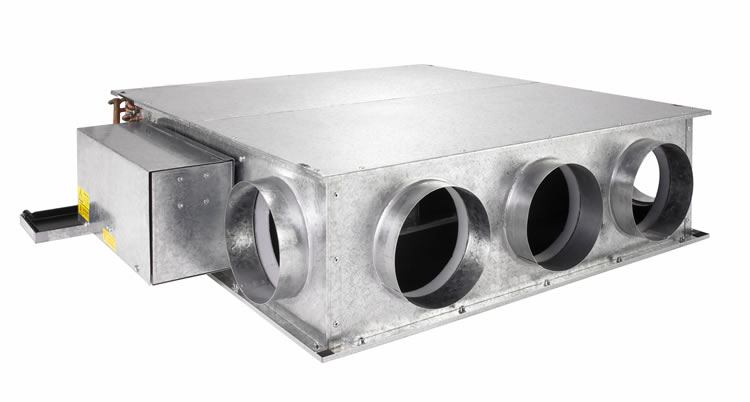
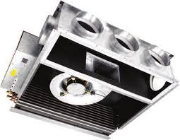

## DX-O-1 - Fan Coil Units

_[\hyperlink{toc}{TOC}]_ Fan Coil Units - Pr_70_65_03_29

::: {layout-ncol=3}
{width=30mm}

{width=30mm}

{width=30mm}
:::

+------------------------------+----------------------------------------------+
| **Identity Data**            |                                              |
+==============================+==============================================+
| Abbreviation                 | DX-O                                         |
+------------------------------+----------------------------------------------+
| Type Reference               | 1                                            |
+------------------------------+----------------------------------------------+
| Uniclass Product Code        | Pr_70_65_03_29                               |
+------------------------------+----------------------------------------------+
| Uniclass Product Description | Fan coil units                               |
+------------------------------+----------------------------------------------+

: {tbl-colwidths="[30,70]"}

+----------------------+----------------------------------------------+
| **Dimensional Data** |                                              |
+======================+==============================================+
| Overall Length       | 285.0 _mm_                                   |
+----------------------+----------------------------------------------+
| Overall Width        | 765.0 _mm_                                   |
+----------------------+----------------------------------------------+
| Overall Height       | 550.0 _mm_                                   |
+----------------------+----------------------------------------------+
| Gross Weight         | 32.0 _kg_                                    |
+----------------------+----------------------------------------------+

: {tbl-colwidths="[30,70]"}

+------------------------+----------------------------------------------+
| **Performance Data**   |                                              |
+========================+==============================================+
| Cooling Output         | 3400.0 _W_                                   |
+------------------------+----------------------------------------------+

: {tbl-colwidths="[30,70]"}

+----------------------+----------------------------------------------+
| **Application Data** |                                              |
+======================+==============================================+
| Notes                | R32 refrigerant                              |
+----------------------+----------------------------------------------+
| Application          | Single Split DX outdoor unit, serving DX-I-2 |
+----------------------+----------------------------------------------+

: {tbl-colwidths="[30,70]"}

+---------------------+----------------------------------------------+
| **Electrical Data** |                                              |
+=====================+==============================================+
| Voltage             | 230.0 _V_                                    |
+---------------------+----------------------------------------------+
| Frequency           | 50.0 _Hz_                                    |
+---------------------+----------------------------------------------+
| Frequency           | 50.0 _Hz_                                    |
+---------------------+----------------------------------------------+
| Voltage             | 230.0 _V_                                    |
+---------------------+----------------------------------------------+
| Frequency           | 50.0 _Hz_                                    |
+---------------------+----------------------------------------------+
| Frequency           | 50.0 _Hz_                                    |
+---------------------+----------------------------------------------+
| Voltage             | 230.0 _V_                                    |
+---------------------+----------------------------------------------+
| Frequency           | 50.0 _Hz_                                    |
+---------------------+----------------------------------------------+
| Frequency           | 50.0 _Hz_                                    |
+---------------------+----------------------------------------------+
| Frequency           | 50.0 _Hz_                                    |
+---------------------+----------------------------------------------+
| Voltage             | 230.0 _V_                                    |
+---------------------+----------------------------------------------+
| Frequency           | 50.0 _Hz_                                    |
+---------------------+----------------------------------------------+
| Frequency           | 50.0 _Hz_                                    |
+---------------------+----------------------------------------------+
| Voltage             | 230.0 _V_                                    |
+---------------------+----------------------------------------------+
| Frequency           | 50.0 _Hz_                                    |
+---------------------+----------------------------------------------+
| Frequency           | 50.0 _Hz_                                    |
+---------------------+----------------------------------------------+
| Voltage             | 230.0 _V_                                    |
+---------------------+----------------------------------------------+
| Frequency           | 50.0 _Hz_                                    |
+---------------------+----------------------------------------------+
| Frequency           | 50.0 _Hz_                                    |
+---------------------+----------------------------------------------+
| Voltage             | 230.0 _V_                                    |
+---------------------+----------------------------------------------+
| Frequency           | 50.0 _Hz_                                    |
+---------------------+----------------------------------------------+
| Frequency           | 50.0 _Hz_                                    |
+---------------------+----------------------------------------------+
| Voltage             | 230.0 _V_                                    |
+---------------------+----------------------------------------------+
| Frequency           | 50.0 _Hz_                                    |
+---------------------+----------------------------------------------+
| Frequency           | 50.0 _Hz_                                    |
+---------------------+----------------------------------------------+
| Frequency           | 50.0 _Hz_                                    |
+---------------------+----------------------------------------------+
| Voltage             | 230.0 _V_                                    |
+---------------------+----------------------------------------------+
| Frequency           | 50.0 _Hz_                                    |
+---------------------+----------------------------------------------+
| Frequency           | 50.0 _Hz_                                    |
+---------------------+----------------------------------------------+
| Voltage             | 230.0 _V_                                    |
+---------------------+----------------------------------------------+
| Frequency           | 50.0 _Hz_                                    |
+---------------------+----------------------------------------------+
| Frequency           | 50.0 _Hz_                                    |
+---------------------+----------------------------------------------+
| Voltage             | 230.0 _V_                                    |
+---------------------+----------------------------------------------+
| Frequency           | 50.0 _Hz_                                    |
+---------------------+----------------------------------------------+
| Frequency           | 50.0 _Hz_                                    |
+---------------------+----------------------------------------------+
| Voltage             | 230.0 _V_                                    |
+---------------------+----------------------------------------------+
| Frequency           | 50.0 _Hz_                                    |
+---------------------+----------------------------------------------+
| Frequency           | 50.0 _Hz_                                    |
+---------------------+----------------------------------------------+
| Voltage             | 230.0 _V_                                    |
+---------------------+----------------------------------------------+
| Frequency           | 50.0 _Hz_                                    |
+---------------------+----------------------------------------------+
| Frequency           | 50.0 _Hz_                                    |
+---------------------+----------------------------------------------+
| Frequency           | 50.0 _Hz_                                    |
+---------------------+----------------------------------------------+
| Voltage             | 230.0 _V_                                    |
+---------------------+----------------------------------------------+
| Frequency           | 50.0 _Hz_                                    |
+---------------------+----------------------------------------------+
| Frequency           | 50.0 _Hz_                                    |
+---------------------+----------------------------------------------+
| Voltage             | 230.0 _V_                                    |
+---------------------+----------------------------------------------+
| Frequency           | 50.0 _Hz_                                    |
+---------------------+----------------------------------------------+
| Frequency           | 50.0 _Hz_                                    |
+---------------------+----------------------------------------------+

: {tbl-colwidths="[30,70]"}